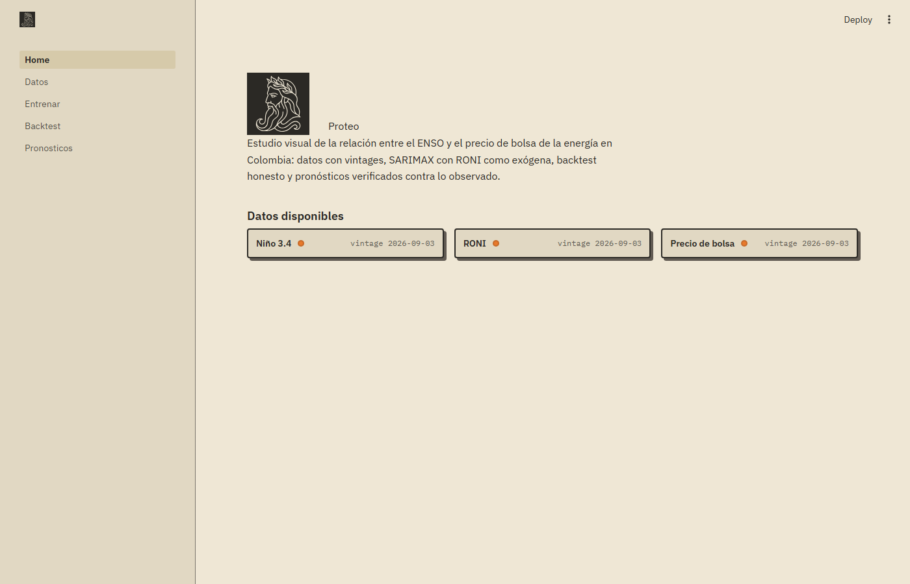
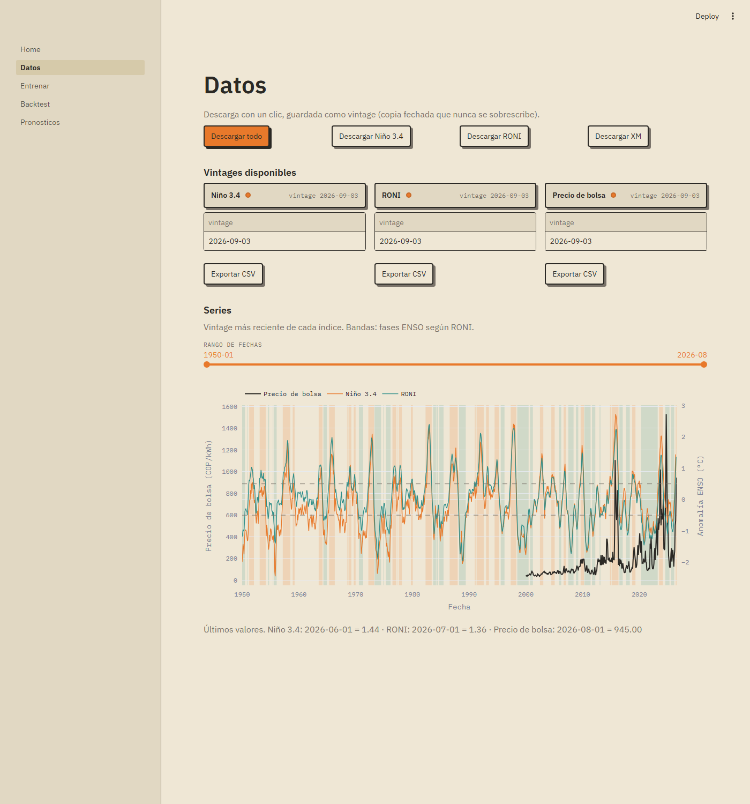
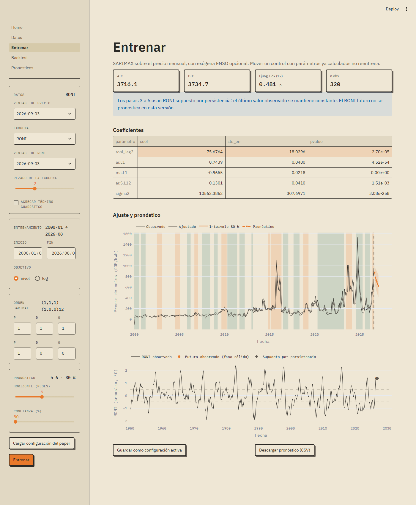
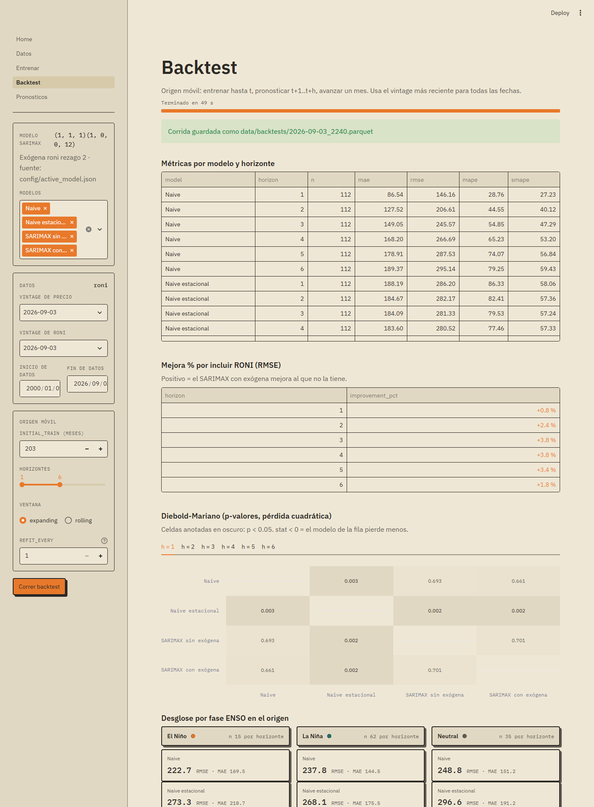
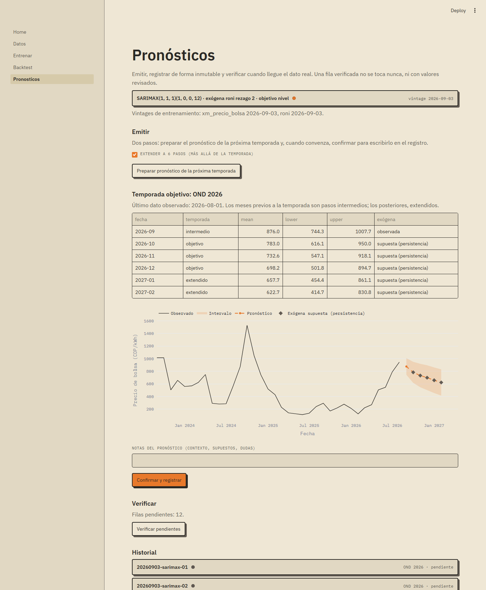

<p align="center">
  
</p>

<p align="center"><em>ENSO y precio de bolsa en Colombia, con pronósticos que se verifican.</em></p>

Proteo es un estudio visual de la relación entre el ENSO y el precio de
bolsa de la energía en Colombia: descarga con un clic los índices Niño 3.4
y RONI (NOAA/CPC) y el precio de bolsa nacional (XM), entrena modelos
SARIMAX con RONI como regresor exógeno y permite mover los parámetros y
ver el resultado al instante. Cada descarga se guarda como *vintage*
(copia fechada), cada pronóstico emitido queda registrado de forma
inmutable y se verifica contra el valor observado cuando llega. Está
pensado para estudiantes e investigadores de energía y clima que quieren
reproducir, auditar o extender el análisis sin pelear con scripts sueltos.

## Capturas











## Instalación

1. Clonar el repositorio:
   `git clone https://github.com/PedroMartk9i/Proteo.git`
2. Doble clic en **`run.bat`** (requiere Python 3.11+ en el PATH; la
   primera vez crea el entorno e instala dependencias, tarda unos minutos).
3. Esperar: el navegador se abre solo en `http://localhost:8765` cuando
   el servidor responde.

¿Prefieres una ventana propia en vez del navegador? Doble clic en
**`run_desktop.bat`**: abre Proteo en una ventana nativa de 1400×900 y al
cerrarla detiene el servidor.

## Flujo de uso

1. **Datos** — botón «Descargar todo»: baja Niño 3.4, RONI y el precio XM,
   y guarda el vintage del día. La gráfica muestra ENSO y precio juntos.
2. **Entrenar** — elegir exógena, rezago y órdenes SARIMAX (o cargar la
   configuración del paper), entrenar, revisar coeficientes y diagnósticos,
   y guardar la configuración activa.
3. **Backtest** — origen móvil contra los baselines naive: métricas por
   horizonte, mejora por incluir RONI, Diebold-Mariano y desglose por
   fase ENSO. Cada corrida queda guardada y se puede recargar.
4. **Pronósticos** — emitir el pronóstico de la próxima temporada con la
   configuración activa, registrarlo con notas y exportar el boletín.
5. **Verificar** — cuando XM publique el mes siguiente: descargar en
   Datos y pulsar «Verificar pendientes». La fila verificada queda
   sellada para siempre; así se sabe si Proteo acierta.

## Estructura del repositorio

```
proteo/                 # núcleo, sin Streamlit
  schema.py             # contrato de datos: COLUMNS, validate(df)
  data/
    nino34.py           # adaptador Niño 3.4 (referencia para los demás)
    roni.py             # adaptador RONI, mismo patrón que nino34
    xm.py               # adaptador precio de bolsa XM vía pydataxm
  store/
    vintages.py         # guardar y cargar vintages
  models/
    base.py             # interfaz común: fit(y, X), forecast(h, X_future)
    naive.py            # naive y naive estacional (12)
    sarimax.py          # SARIMAX de statsmodels con exógena opcional
  backtest/
    rolling_origin.py   # origen móvil
    metrics.py          # MAE, RMSE, MAPE por horizonte
    dm_test.py          # prueba Diebold-Mariano
  forecasts/
    seasons.py          # temporadas CPC (DJF ... NDJ)
    registry.py         # registro inmutable de pronósticos y verificación
app/
  Home.py               # portada
  pages/
    1_Datos.py
    2_Entrenar.py
    3_Backtest.py
    4_Pronosticos.py
data/                   # ignorado por git salvo data/.gitkeep
  raw/<index>/<YYYY-MM-DD>.<ext>
  processed/<index>/<YYYY-MM-DD>.parquet
  backtests/            # corridas de backtest (parquet + json)
  forecasts/            # registro de pronósticos y boletines
examples/               # fixtures reales: crudos y salidas esperadas
tests/
run.bat                 # arranque con doble clic (navegador)
run_desktop.bat         # arranque en ventana propia (pywebview)
STATUS.md               # estado del proyecto, sesión a sesión
```

## Cómo agregar una fuente nueva

1. Copiar `proteo/data/nino34.py` con otro nombre (es el adaptador de
   referencia).
2. Cambiar la constante `URL` y reescribir `parse()` para el formato de
   la fuente. `fetch_raw()` toca la red; `parse()` es pura y devuelve el
   contrato de datos (5 columnas, ver `proteo/schema.py`). Registrar el
   nombre del índice en `ALLOWED_INDEX` de `schema.py`.
3. Escribir `tests/test_<fuente>.py` con un fixture inline y, si hay
   archivo real, uno en `examples/`. Los tests nunca tocan la red: solo
   prueban `parse()`.
4. Agregar el botón en `app/pages/1_Datos.py` (diccionario `ADAPTERS`).

## Fuentes de datos

| Fuente | URL / API | Cita |
|---|---|---|
| Niño 3.4 mensual (ERSSTv5, base 1991-2020) | <https://www.cpc.ncep.noaa.gov/data/indices/ersst5.nino.mth.91-20.ascii> | NOAA Climate Prediction Center, *Monthly Niño Region SST Indices* |
| RONI (Relative Oceanic Niño Index, base 1991-2020) | <https://www.cpc.ncep.noaa.gov/data/indices/RONI.ascii.txt> | NOAA Climate Prediction Center, *Relative Oceanic Niño Index* |
| Precio de bolsa nacional (COP/kWh) | `pydataxm.ReadDB().request_data("PrecBolsNaci", "Sistema", inicio, fin)` | XM S.A. E.S.P., API de datos abiertos vía [pydataxm](https://github.com/EquipoAnaliticaXM/API_XM) |

**Sobre los vintages**: NOAA revisa valores hacia atrás (se ha observado
en este proyecto: MJJ 2026 pasó de 0.98 a 0.97 entre agosto y septiembre
de 2026). Por eso ninguna descarga sobrescribe a otra: cada día de
descarga produce una copia fechada en `data/raw/` y `data/processed/`, y
un backtest honesto debe usar los datos que existían en la fecha del
pronóstico, no los de hoy. Detalle de formatos en `SOURCES.md`.

## Créditos

- **Autor**: Pedro Martínez — Universidad Autónoma de Bucaramanga (UNAB).
- **Grupo de investigación**: *(por completar)*.
- **Trabajo de origen**: *(por completar: título del paper y coautores)*.

Proteo toma su nombre del dios griego que cambia de forma y conoce el
futuro, pero solo se lo revela a quien logra sujetarlo.
